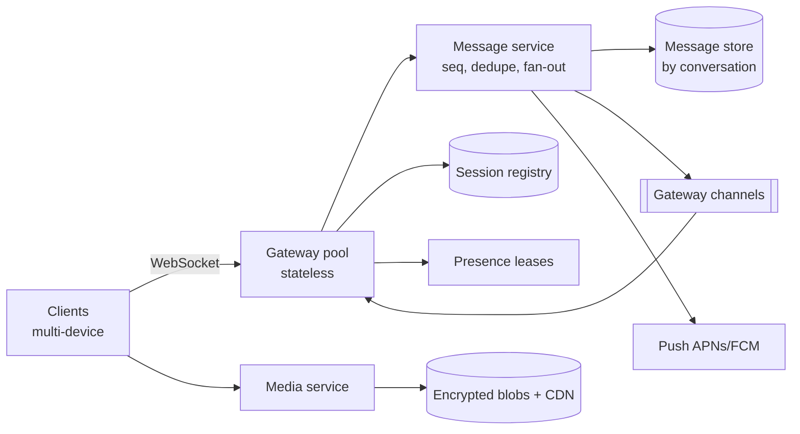

# Real-Time Messaging Platform — Reference System Design and Prototype

[](https://github.com/shivkumarsinghsky/realtime-messaging-platform/actions/workflows/ci.yml)


A **real-time messaging platform** reference system design by **Shiv Kumar**, with a runnable Python prototype of
its core. The design covers WebSocket gateways at scale, distributed message delivery, per-conversation ordering,
retries and idempotency, delivery/read receipts, presence, push notifications, media and end-to-end encryption
concepts.

> **Reference system design inspired by publicly known product requirements** of mobile messaging apps. It is not
> WhatsApp's (or any company's) actual architecture. The repository name reflects the product category only.

## Architecture



Full design (requirements, capacity estimate, flows, data model, scaling, E2EE, trade-offs):
[docs/architecture.md](docs/architecture.md).

## Key Capabilities

| Topic | Design | Prototype |
|---|---|---|
| User identity | Device-bound tokens; multi-device | Token → user; several connections per user |
| One-to-one and group messaging | Conversations with members; groups ≤ 1,024 | `direct`, `create_group` frames |
| Message ordering | Server-assigned sequence per conversation | `MessageStore.append` |
| Retries and idempotency | Client message ids; dedup index; ack after durable write | Duplicate send → same `seq`, no re-delivery |
| Delivery and read receipts | Cumulative watermarks per member; aggregate status | `delivered` / `read` frames, `status()` |
| Presence | Heartbeat leases with TTL; privacy for last seen | `PresenceService` |
| Offline users | Push notification without content; sync by `seq` on reconnect | `hello` + `sync` frames |
| Horizontal scaling | Stateless gateways, session registry, per-gateway channels | Two gateways in one test exchanging messages |
| Media | Encrypted upload to object storage; reference in message | Design only |
| End-to-end encryption | Signal-style X3DH + Double Ratchet + sender keys | Bodies treated as opaque ciphertext (no crypto implemented) |

## Technology Stack

| Area | Prototype | Production design |
|---|---|---|
| Gateways | Python, FastAPI WebSockets | Thin gateways (Go/Erlang/Java/Node), L4 load balancing |
| Message store | In-memory class with production semantics | Wide-column store (Cassandra/ScyllaDB-style) |
| Registry / bus | Thread-safe in-process implementations | Redis cluster, Redis pub/sub or broker |
| Push | Recorder | APNs, FCM |

## Repository Structure

```text
realtime-messaging-platform/
├── src/messaging/
│   ├── domain.py      # conversations, ordered log, idempotent append, receipt watermarks
│   ├── presence.py    # heartbeat leases, last seen privacy
│   ├── routing.py     # session registry, gateway bus, push notifier
│   ├── gateway.py     # WebSocket protocol and routing
│   └── __main__.py    # run a gateway
├── tests/             # domain + two-gateway WebSocket tests
├── docs/              # system design, ADRs
└── docker/  docker-compose.yml
```

## Getting Started

```bash
git clone https://github.com/shivkumarsinghsky/realtime-messaging-platform.git
cd realtime-messaging-platform
python3 -m venv .venv && source .venv/bin/activate
pip install -e ".[dev]"
pytest
python -m messaging --port 8000          # or: docker compose up -d --build
```

Connect two clients (e.g. with `websocat`):

```text
websocat "ws://localhost:8000/ws?token=token-alice"
< {"type": "hello", "user": "alice", "conversations": []}
> {"type": "direct", "user": "bob"}
< {"type": "direct", "conversationId": "d:alice:bob"}
> {"type": "send", "conversationId": "d:alice:bob", "clientMsgId": "m-1", "body": "<ciphertext>"}
< {"type": "ack", "clientMsgId": "m-1", "seq": 1, "messageId": "…", "duplicate": false}
```

## Configuration

The prototype has no external configuration; dev users are `alice`, `bob`, `carol`, `dave` with tokens
`token-<user>`. Real deployments use verified JWTs and configuration for the registry, bus and store.

## API (WebSocket protocol)

| Client → server | Server → client |
|---|---|
| `send {conversationId, clientMsgId, body}` | `ack {clientMsgId, seq, messageId, duplicate}` |
| `delivered`/`read {conversationId, upToSeq}` | `message {conversationId, seq, sender, body}` to recipients |
| `sync {conversationId, afterSeq}` | `messages {items}` |
| `ping` | `pong` |
| `presence {user}` | `presence {user, online, lastSeen?}` |
| `direct {user}`, `create_group {members}` | `direct` / `group {conversationId}` |
| — | `hello {conversations: [{id, lastSeq, delivered}]}` on connect; `receipt {user, state, upToSeq}` |

## Testing

```bash
pytest                    # domain rules + WebSocket tests across two gateway instances
ruff check . && mypy
```

The tests verify:

- per-conversation ordering;
- that a retried send is acked as a duplicate and not re-delivered;
- receipt watermarks (out-of-order acks, read implies delivered, group aggregation);
- presence lease expiry and privacy;
- cross-gateway delivery and multi-device fan-out;
- push without content for offline users, then sync on reconnect;
- authentication and membership enforcement.

## Docker

`docker/Dockerfile` runs one gateway; `docker-compose.yml` exposes it on port 8000.

## Architecture Decisions

| ADR | Decision |
|---|---|
| [ADR-001](docs/decisions/ADR-001-stateless-websocket-gateways.md) | Stateless WebSocket gateways with a session registry |
| [ADR-002](docs/decisions/ADR-002-per-conversation-sequence-numbers.md) | Per-conversation sequence numbers |
| [ADR-003](docs/decisions/ADR-003-idempotent-sends-and-receipt-watermarks.md) | Idempotent sends, cumulative receipt watermarks |
| [ADR-004](docs/decisions/ADR-004-end-to-end-encryption.md) | End-to-end encryption: server stores ciphertext only |
| [ADR-005](docs/decisions/ADR-005-wide-column-store-by-conversation.md) | Wide-column store partitioned by conversation |

## Scalability Considerations

- **Gateways:** about 50M concurrent connections ≈ 500 gateway nodes at ~100K sockets each; L4 load balancing;
  graceful draining with jittered reconnects.
- **Message service:** stateless and autoscaled; per-gateway batching for group fan-out.
- **Store:** partitioned by `conversation_id`, bucketed for huge conversations, replicated across zones.
- **Presence:** TTL leases and batched, interest-based updates to limit churn.
- **Event-driven delivery:** asynchronous; the store is the source of truth and the bus is best-effort.

## Reliability

Acks only after durable writes. Client resend with the same id, and sync from the last `seq` after reconnects.
Registry leases expire so dead gateways do not black-hole messages. Push for offline users, with retries.

## Security

TLS, device-bound tokens, membership checks on every operation, rate limits against spam, end-to-end encryption
(the server stores ciphertext only), push payloads without content, and no message bodies in logs.

## Observability

Connections per gateway, outbound queue depth, ack latency, send-to-device latency, duplicate rate, sync volume,
push success rate, presence churn; correlation by `messageId`.

## Future Improvements

Not implemented in the prototype:

- Redis-backed registry and pub/sub, and a Cassandra-style store adapter.
- Media upload service.
- Key directory and an actual end-to-end encryption implementation.
- Typing indicators.
- Message edits and deletes as log events.
- Backpressure for slow consumers beyond the bounded per-connection queue.

## Related Projects

- [System Design Architecture](https://github.com/shivkumarsinghsky/system-design-architecture) — [real-time messaging design](https://github.com/shivkumarsinghsky/system-design-architecture/blob/main/docs/designs/02-real-time-messaging.md) and capacity model
- [Event-Driven Platform](https://github.com/shivkumarsinghsky/event-driven-platform) — idempotent consumers and retries
- [Microservices Patterns](https://github.com/shivkumarsinghsky/microservices-patterns) — idempotency, service discovery, observability
- [Social Media Platform](https://github.com/shivkumarsinghsky/social-media-platform) — feeds and notifications at scale

## Author

**Shiv Kumar** — Senior Software Engineer / Software Architect
GitHub: [github.com/shivkumarsinghsky](https://github.com/shivkumarsinghsky)

## License

[MIT](LICENSE)
