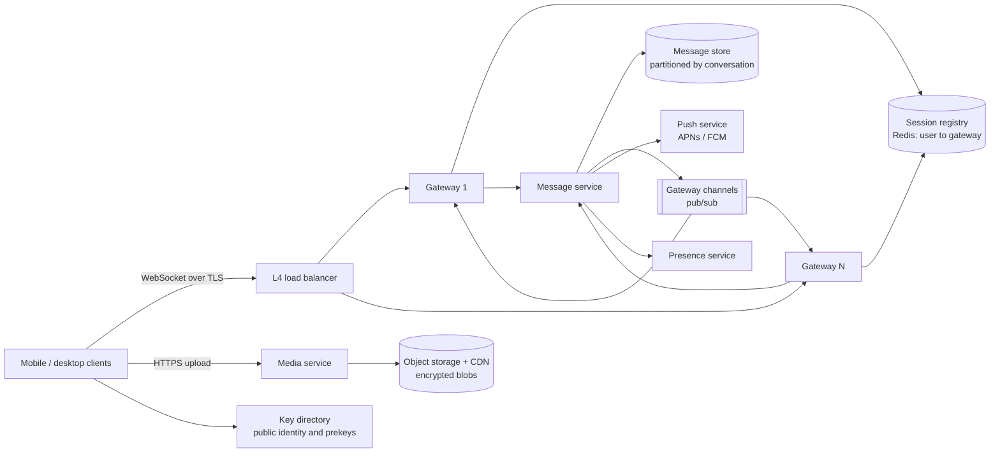
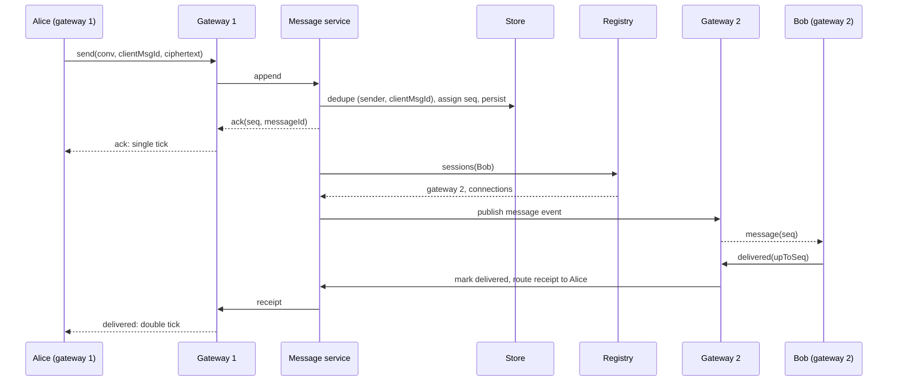
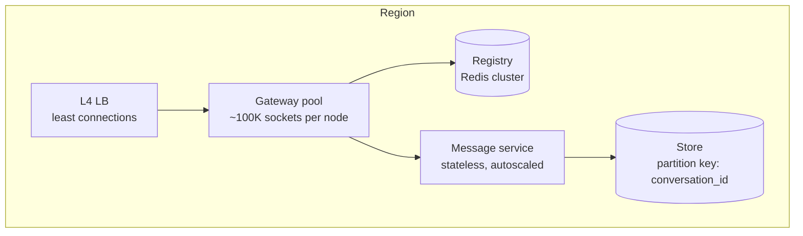
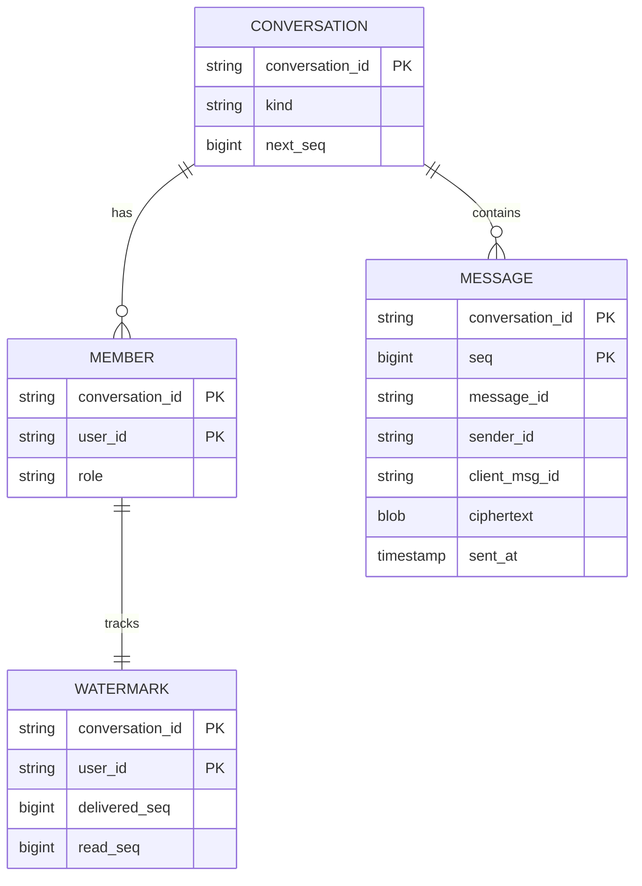

# Real-Time Messaging Platform — Reference System Design

> Reference system design inspired by publicly known product requirements of mobile messaging apps.
> It is not a description of any company's internal architecture; numbers are illustrative assumptions.

**Author:** Shiv Kumar · [GitHub](https://github.com/shivkumarsinghsky)

## Requirements

### Functional

- User identity by phone number/account; multiple devices per user.
- One-to-one and group messaging (groups up to 1,024 members).
- Delivery and read receipts; online/offline presence and last seen (privacy-controlled).
- Media (images, video, documents) via attachments.
- Push notifications for offline users; history sync when a device reconnects.
- End-to-end encryption: the server never sees plaintext.

### Non-functional

| Concern | Target |
|---|---|
| Delivery latency | < 300 ms p95 between online users in the same region |
| Durability | A message acknowledged to the sender is never lost |
| Ordering | Total order per conversation; no global order |
| Duplicates | Client retries never create duplicate messages |
| Availability | 99.99% for send/receive |
| Scale (assumption) | 100M DAU, 40 messages/user/day, 50M concurrent connections at peak |

## Capacity Estimation

| Metric | Estimate |
|---|---|
| Messages/day | 100M × 40 = 4B |
| Write QPS (avg / peak ×3) | ~46K/s / ~140K/s |
| Message size (envelope + ciphertext) | ~200 B (media stored separately) |
| Message storage/day | 4B × 200 B ≈ 0.8 TB (×3 replication ≈ 2.4 TB) |
| Concurrent connections | 50M; at ~100K connections per gateway node ≈ 500 gateway nodes |
| Fan-out | Average delivery events ≈ messages × (recipients per message) |

The same numbers come from the capacity model in
[system-design-architecture](https://github.com/shivkumarsinghsky/system-design-architecture)
(`python -m capacity messaging`).

## High-Level Architecture



| Component | Responsibility |
|---|---|
| **Gateway** | Terminates WebSockets, authenticates, keeps per-connection outbound queues, heartbeats. Stateless apart from live sockets. |
| **Session registry** | `user → {(gateway, connection)}` with TTL; lets any service find where a user is connected. |
| **Message service** | Validates membership, assigns per-conversation sequence numbers, deduplicates, persists, fans out. |
| **Message store** | Durable ordered log per conversation; range reads by sequence for sync. |
| **Gateway channels** | Pub/sub topic per gateway; the message service publishes delivery events to the recipient's gateway. |
| **Push service** | Notifies offline devices (no content when end-to-end encrypted). |
| **Presence** | Heartbeat leases; online/last seen. |
| **Media service** | Upload of encrypted media blobs; messages carry only a reference and the decryption key. |
| **Key directory** | Public identity keys and one-time prekeys for session setup (Signal-protocol style). |

## Message Flow



**Ack semantics:** the sender's ack is returned only after the message is durable. Delivery to recipients is
asynchronous; if a recipient is offline or their gateway is gone, the message waits in the store and is synced on
reconnect, and a push notification is sent.

## Ordering, Retries and Idempotency

- **Per-conversation sequence numbers** are assigned atomically by the store (single leader per conversation
  partition). Clients render by `seq`, detect gaps (`seq` jumps) and call `sync(afterSeq)`.
- **Idempotent sends:** the client generates `clientMsgId` before the first attempt; the store keeps a
  `(sender, clientMsgId) → message` index. A retry after a lost ack returns the original `seq` and is not fanned out
  again.
- **At-least-once delivery to devices:** events can be redelivered after reconnects; clients drop messages whose
  `seq` they already have.
- **Receipts are cumulative watermarks** ("delivered up to seq N"), so one frame acknowledges many messages and
  late/out-of-order receipts cannot move state backwards.

## WebSockets and Horizontal Scaling



- Connections are long-lived: use **L4 load balancing**, keep gateways thin, and tune kernel limits (file
  descriptors, ephemeral ports, TCP keepalive).
- **Draining** on deploy: stop accepting, ask clients to reconnect elsewhere with jitter, close after a grace period —
  avoids reconnect storms.
- Heartbeats every ~30 s keep NAT mappings alive and renew presence leases (TTL ~45 s).
- The registry is the only shared hot-path state; entries expire with the connection lease so dead gateways do not
  black-hole messages.
- Large groups: fan-out is done by the message service in batches per gateway (one publish per gateway carrying many
  recipients), not one publish per recipient.

## Presence

Presence is high-churn and low-value per update. Leases with TTL avoid explicit offline events; updates to contacts
are batched and rate-limited, and only sent to users who currently have the conversation or contact list open.
Last seen respects privacy settings.

## End-to-End Encryption (concepts)

The prototype treats message bodies as opaque ciphertext; it does not implement cryptography. The reference design
follows the widely published Signal-protocol approach:

- Each device has an identity key pair and uploads signed prekeys and one-time prekeys to the key directory.
- Session setup uses an asynchronous key agreement (X3DH) with the recipient's prekeys, so messages can be sent while
  the recipient is offline.
- The **Double Ratchet** derives a new key per message (forward secrecy and post-compromise security).
- Groups use **sender keys**: each member distributes a sender key to the others pairwise; messages are encrypted
  once and fanned out by the server.
- Media is encrypted on the device with a random key; the blob goes to object storage and the key travels inside
  the encrypted message.
- Consequences for the server: no server-side search or content moderation of message text; push payloads carry no
  content; multi-device needs per-device sessions.

## API Design

```text
WebSocket /ws  (TLS, token in the upgrade request)
  send {conversationId, clientMsgId, body}        → ack {seq, messageId, duplicate}
  delivered|read {conversationId, upToSeq}        → receipts routed to other members
  sync {conversationId, afterSeq}                 → messages [...]
  ping                                            → pong (renews presence lease)

HTTPS
  POST /v1/media              → upload URL for an encrypted blob
  GET  /v1/keys/{userId}      → identity key + one prekey (consumed)
  POST /v1/groups             → create group; membership changes are messages in the group log
```

## Data Model



Storage choice: a wide-column store (Cassandra/ScyllaDB-style) with partition key `conversation_id` and clustering key
`seq` gives append-heavy writes and efficient range reads for sync. Very large or long-lived conversations are
bucketed (`conversation_id, bucket`) to bound partition size. Server-side retention can be limited to undelivered or
recent messages when devices keep the history ([ADR-005](decisions/ADR-005-wide-column-store-by-conversation.md)).

## Caching

- Registry and presence in Redis (in-memory, TTL-based).
- Recent messages of active conversations cached for fast sync after brief disconnects.
- Group membership cached at the message service with invalidation on membership events.

## Reliability

- Message acked only after a quorum write; store replicated across zones.
- Gateway crash: clients reconnect (exponential backoff + jitter), resend unacked messages with the same
  `clientMsgId`, and sync from their last `seq`.
- Registry entries expire; publishes to a dead gateway are dropped safely because the store is the source of truth.
- Push notification failures are retried; tokens invalidated by the platform are removed.

## Security

- TLS everywhere; device-bound tokens; rate limits per account and device on sends and group creation (anti-spam).
- Membership checked on every send and sync; non-members get "not found".
- End-to-end encryption as above; metadata minimisation (short retention of delivery logs).
- Abuse reporting relies on user-submitted messages (the reporter's client forwards plaintext), since the server
  cannot read content.

## Observability

- Gateway: open connections, connects/disconnects per second, outbound queue depth, heartbeat misses.
- Message service: send latency (ack), delivery latency (send → device), duplicate rate, sync volume.
- Push: success/failure by platform. Presence: lease churn.
- Correlate by `messageId` across services; never log message bodies.

## Trade-offs

| Decision | Benefit | Cost |
|---|---|---|
| Per-conversation sequence | Simple ordering and gap detection | Hot conversations serialize on one partition leader |
| Ack after durable write | No lost acknowledged messages | Adds write latency to the send path |
| Cumulative receipt watermarks | Few receipt frames, order-insensitive | Cannot mark individual messages as read out of order |
| End-to-end encryption | Server compromise does not expose content | No server-side search/moderation; complex multi-device |
| Thin, stateless gateways | Easy scaling and draining | Extra hop through the registry/bus |
